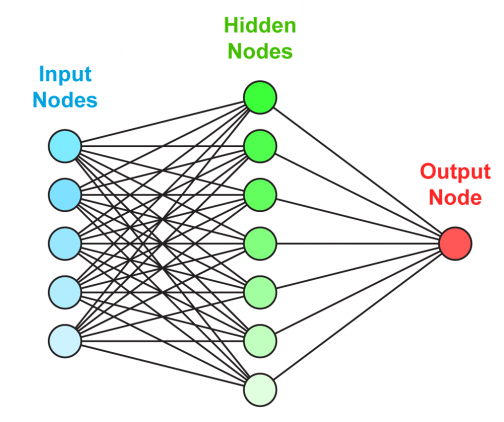

# Topic 1: What is an Artificial Neural Network (ANN)

A neural network is like a collection of tiny connected calculators.  
They work together to solve problems — such as recognizing an object in an image or understanding the meaning of a sentence.

---

## How does it work (in simple terms)?

1. You give it some data (like an image or text)  
2. It processes the data through layers of small operations (neurons)  
3. It gives a prediction (like "this is a cat")  
4. If the prediction is wrong, it adjusts itself to improve next time  

---

## Structure of a neural network

- **Input Nodes** — raw input data, e.g., image pixels  
- **Hidden Nodes** — perform internal calculations and extract patterns  
- **Output Node** — final result or prediction

Each connection between nodes has a **weight**.  
Stronger weights influence the output more. During training, these weights are updated to reduce prediction errors.

---

*Image: A simple feedforward neural network with one hidden layer.*

---

## Why use neural networks?

- Traditional code can't interpret raw image or language data  
- Neural networks learn from data without needing hard-coded rules  
- They are the foundation of modern AI systems like ChatGPT, image generators, self-driving cars, etc.

---

## Recommended Videos

- [Neural Networks from Scratch (3Blue1Brown style animation)](https://www.youtube.com/watch?v=V-OBpiYLQOI)  
- [How Neural Networks Work — Visual Explanation](https://www.youtube.com/watch?v=RJCIYBAAiEI)

---

[Back to main page](../README.md)
