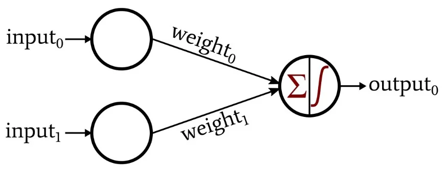
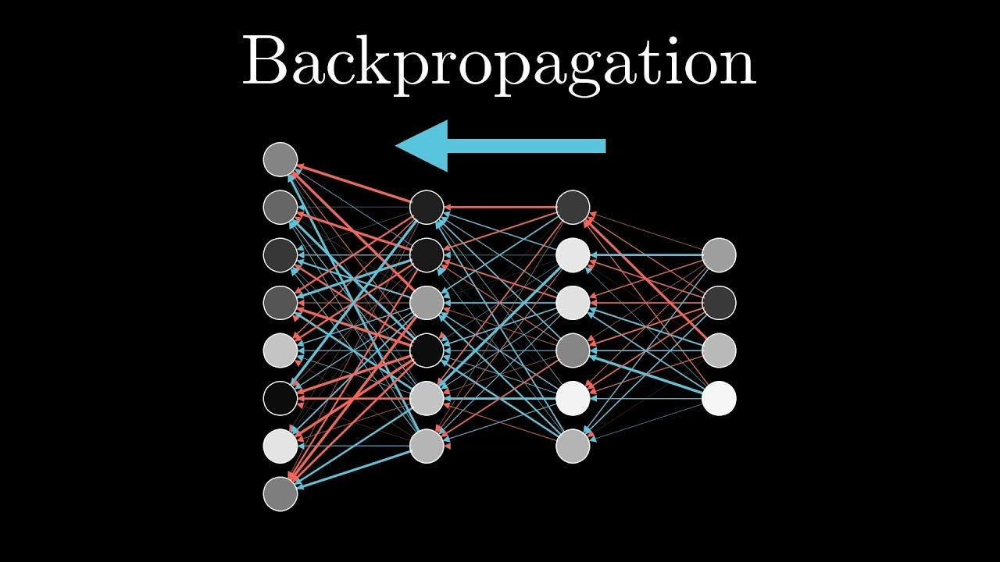

# Topic 2: How Neural Networks Learn – Forward & Backpropagation

To understand how a neural network **learns**, you need to know two main things:

- **Forward propagation** — how it makes a prediction  
- **Backpropagation** — how it learns from mistakes

---

## Perceptron – The Simplest Neuron

A **perceptron** is a basic unit of a neural network.  
It does this:

output = activation(w1x1 + w2x2 + ... + wn*xn + bias)

- `x1, x2...` – inputs  
- `w1, w2...` – weights (what the model learns)  
- `bias` – a small shift added to the result  
- `activation` – a function that shapes the output

*Image: The Simplest Neuron.*

---

## What Are Weights and Bias?

- **Weights** are like "importance values" for each input.  
  The model updates these during training to make better predictions.

- **Bias** allows the model to shift the output up/down regardless of input.  
  Think of it as an extra push.

---

## Activation Functions

Activation functions decide what signal moves forward in a neural network.  
They introduce **non-linearity**, allowing the network to learn complex patterns.

| Function    | What it does                             | When to use               |
|-------------|------------------------------------------|---------------------------|
| **Sigmoid** | Squashes output to [0, 1]                | Binary classification     |
| **ReLU**    | If input > 0 → returns input, else 0     | Most common, fast training|

*Image: Example of Sigmoid and ReLU functions.*

### Why are activation functions needed?

Without activation functions, neural networks would behave like linear models,  
no matter how many layers they have. Activation functions introduce **non-linearity**,  
which enables neural networks to model complex functions like images, speech, and language.  
They allow the network to learn and represent intricate patterns beyond simple linear relationships.

---

## Forward Propagation

This is when the input goes **through the network** to produce a prediction:

1. Multiply inputs by weights  
2. Add bias  
3. Pass through activation  
4. Repeat for each layer  
5. Output a prediction

Example:  
> You give it an image → it outputs "dog"

---

## Loss Function — Measuring How Wrong

The **loss** tells the model how bad its prediction was.

| Type               | Use Case              |
|--------------------|-----------------------|
| **MSE**            | For predicting numbers (regression) |
| **CrossEntropyLoss** | For classifying into categories (classification) |

The goal is always to **minimize the loss**.

---

## Backpropagation – Learning From Mistakes

Once the model sees how wrong it was, it works **backward** to fix itself:

1. It calculates how much each weight caused the error  
2. Finds the **gradient** (derivative) — direction to move to fix it  
3. Updates the weights using **gradient descent**

> This is how the model improves after each example.

---

## Epochs — How Many Times to Train?

An **epoch** is one full pass through the training data.

- 1 epoch = the model sees all training examples once  
- We often train for 10, 20, or even 100+ epochs  
- More epochs = more learning, but too many = **overfitting**

---

## TL;DR – Summary Table

| Concept        | Description |
|----------------|-------------|
| **Perceptron** | Simple neuron: sum of inputs × weights + bias |
| **Weight**     | Value that controls importance of input |
| **Bias**       | Allows shifting the result |
| **Activation** | Adds flexibility (non-linearity) |
| **Forward**    | Make a prediction |
| **Loss**       | How wrong is the prediction? |
| **Backprop**   | Adjust weights to reduce error |
| **Epoch**      | One full loop through training data |

---

## Recommended Videos

- [Gradient Descent](https://www.youtube.com/watch?v=f9oDe4Yq4E0)
- [Neural Networks from Scratch (3Blue1Brown style animation)](https://www.youtube.com/watch?v=V-OBpiYLQOI)
- [The perceptron neuron: the simplest AI](https://www.youtube.com/watch?v=xHAG4GJPA-Q)
- [Perceptron: Simplest type of Artificial Neural Network](https://medium.com/deep-ai/perceptron-simplest-type-of-artificial-neural-network-1b571bf193c8)
- [What is Forward Propagation in Neural Networks?](https://www.geeksforgeeks.org/what-is-forward-propagation-in-neural-networks/)
- [Backpropagation in Neural Network](https://www.geeksforgeeks.org/backpropagation-in-neural-network/)

---

[← Back to Main Page](../README.md)

